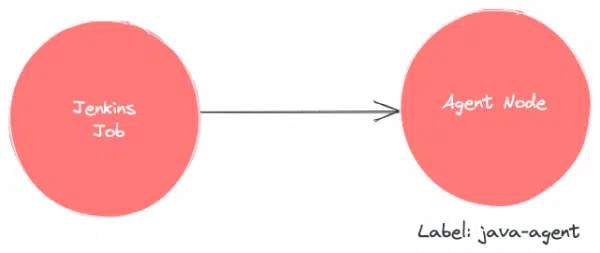

# Day 35 of 100DaysofCode

Feeling excited to start Day 35 of 100 DaysOfCode, today, I read an amazing blog on [Jenkins Architecture Explained – Beginners Guide](https://devopscube.com/jenkins-architecture-explained/) by <b>DevOPsCube</b>. This Blog contains beginner guide to Jenkins, its architecture, its jobs and plugins and many more.

## How the project works?

Clone this repository or simply refer to the README for a quick reference on how my repository works. Feel free to customize the commands based on your needs.

```bash
git clone https://github.com/Pravesh-Sudha/100-Days-Of-Code.git
cd day-35
```

## What is Jenkins?

Jenkins is an easy-to-use open-source java-based CI/CD tool. It has been around for some time, and several organizations use it for their CI/CD needs. 
Important note: It is essential to have an understanding of Continuous integration & continuous delivery to understand Jenkins better.

Jenkins is commonly used for the following:

- Continuous Integration for application and infrastructure code.
- Continuously deliver pipeline to deploy the application to different environments using Jenkins pipeline as code.
- Infrastructure component deployment and management.
- Run batch operations using Jenkins jobs.
- Run ad-hoc operations like backups, cleanups, remote script execution, event triggers, etc.

## Jenkins Architecture

The following image shows the overall architecture of Jenkins: 


Following are the key components in Jenkins:

- Jenkins Master Node
- Jenkins Agent Nodes/Clouds
- Jenkins Web Interface

## Jenkins Master (Server)

Jenkins’s server or master node holds all key configurations. Jenkins master server is like a control server that orchestrates all the workflow defined in the pipelines. For example, scheduling a job, monitoring the jobs, etc.

Let’s have a look at the key Jenkins master components.

- Jenkins Jobs:
    A job is a collection of steps that you can use to build your source code, test your code, run a shell script, run an Ansible role in a remote host or execute a terraform play, etc. We normally call it a Jenkins pipeline.

- Jenkins Plugins:
    Plugins are community-developed modules that you can install on your Jenkins server. It helps you with more functionalities that are not natively available in Jenkins.

    For example, if you want to upload a file to s3 bucket from Jenkins, you can install an AWS Jenkins plugin and use the abstracted plugin functionalities to upload the file rather than writing your own logic in AWS CLI. The plugin takes care of error and exception handling.

    Here is an example, of s3 file upload functionality provided by the AWS Steps plugin:

    

-  Jenkins Credentials:
    When you set up Jenkins pipelines, there are scenarios where it needs to connect to a cloud account, a server, a database, or an API endpoint using secrets.

    In Jenkins, you can save different types of secrets as a credential.

    - Secret text
    - Username & password
    - SSH keys

    All credentials are encrypted (AES) by Jenkins. The secrets are stored in `$JENKINS_HOME/secrets/` directory. It is very important to secure this directory and exclude it from Jenkins backups.    

## Jenkins Agent

Jenkins agents are the worker nodes that actually execute all the steps mentioned in a Job. When you create a Jenkins job, you have to assign an agent to it. Every agent has a label as a unique identifier.



You can have any number of Jenkins agents attached to a master with a combination of Windows, Linux servers, and even containers as build agents.

Also, you can restrict jobs to run on specific agents, depending on the use case. For example, if you have an agent with java 8 configurations, you can assign this agent for jobs that require Java 8 environment.

There is no single standard for using the agents. You can set up a workflow and strategy based on your project needs.

## Jenkins Master-agent Connectivity

You can connect a Jenkins master and agent in two ways

- Using the **SSH** method: Uses the ssh protocol to connect to the agent. The connection gets initiated from the Jenkins master. Ther should be connectivity over port 22 between master and agent.

- Using the **JNLP** method: Uses java JNLP protocol (Java Network Launch Protocol). In this method, a java agent gets initiated from the agent with Jenkins master details. For this, the master nodes firewall should allow connectivity on specified JNLP port. Typically the port assigned will be 50000. This value is configurable.

There are two types of Jenkins agents

- **Agent Nodes**: These are servers (Windows/Linux) that will be configured as static agents. These agents will be up and running all the time and stay connected to the Jenkins server. Organizations use custom scripts to shut down and restart the agents when is not used. Typically during nights & weekends.

- **Agent Clouds**: Jenkins Cloud agent is a concept of having dynamic agents. Means, whenever you trigger a job, a agent gets deployed as a VM/container on demand and gets deleted once the job is completed. This method saves money in terms of infra cost when you have a huge Jenkins ecosystem and continuous builds.

The following image shows a high-level view of different types of agents and connectivity types:


# Jenkins Web Interface

Jenkins 2.0 introduced a very intuitive web interface called “Jenkins Blue Ocean“. It has a good visual representation of all the pipelines.


