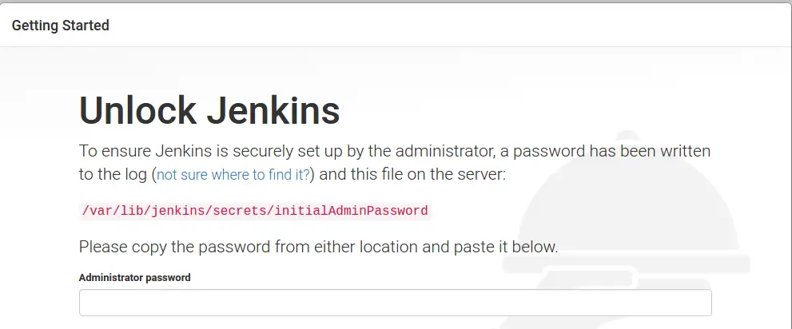
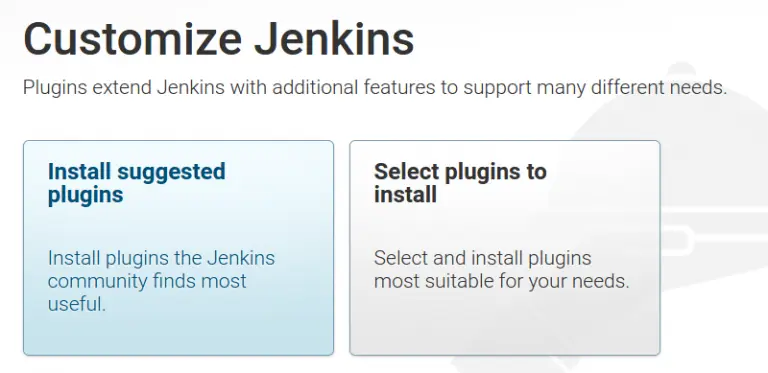
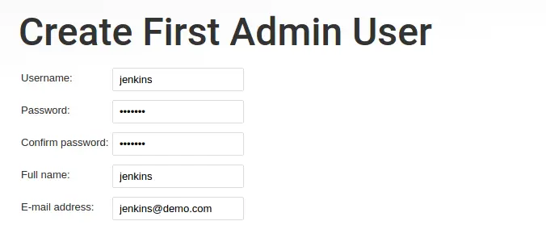
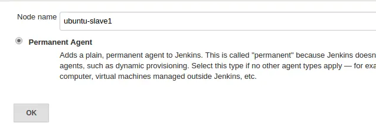
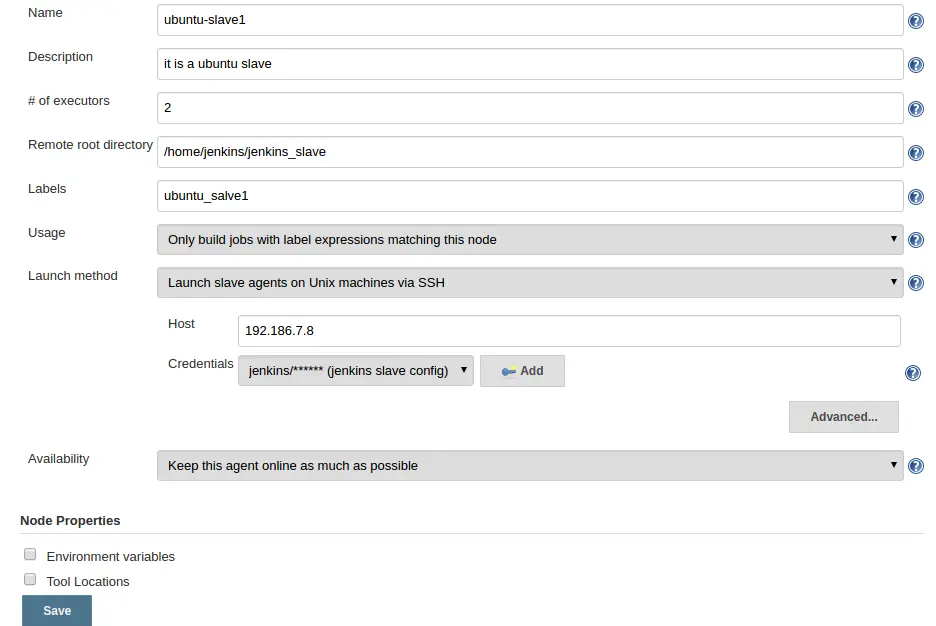

# Day 36 of 100DaysofCode

Feeling excited to start Day 36 of 100 DaysOfCode, today, I read an amazing blog on [Jenkins Architecture Explained – Beginners Guide](https://devopscube.com/jenkins-architecture-explained/) by <b>DevOPsCube</b>. This Blog contains beginner guide to Jenkins, how to install jenkins in ubuntu, creating first admin user and many more.

## How the project works?

Clone this repository or simply refer to the README for a quick reference on how my repository works. Feel free to customize the commands based on your needs.

```bash
git clone https://github.com/Pravesh-Sudha/100-Days-Of-Code.git
cd day-36
```

## Install Jenkins in Ubuntu

- Step 1: Log in to the server and update the package list.

`sudo apt -y update`

- Step 2: Jenkins needs the Java runtime as it is based on Java. Install open JDK 11 package using the following command.

`sudo apt install default-jdk -y`

- Step 3: Add the Jenkins Debian repo.

```
curl -fsSL https://pkg.jenkins.io/debian-stable/jenkins.io.key | sudo tee \
  /usr/share/keyrings/jenkins-keyring.asc > /dev/null
echo deb [signed-by=/usr/share/keyrings/jenkins-keyring.asc] \
  https://pkg.jenkins.io/debian-stable binary/ | sudo tee \
  /etc/apt/sources.list.d/jenkins.list > /dev/null
```

- Step 4: Update the package list again.

`sudo apt update -y`

- Step 5: Install the latest LTS Jenkins.

`sudo apt-get install jenkins -y`

- Step 6: Start the Jenkins service & enable it for starting during bootup.

```
sudo systemctl start jenkins
sudo systemctl enable jenkins
```

- You can check the status of the Jenkins service using the following command.

`sudo systemctl status jenkins`

- Step 7: Now you will be able to access the Jenkins server on port 8080 using the IP address.



- Step 8: As you can see in the above image, you need to provide the administrative password. You can get the password using the following command.

`sudo cat /var/lib/jenkins/secrets/initialAdminPassword`

Copy the password and click continue.

- Step 9: Next, you will be asked to configure plugins as shown below. Select the “Install Suggested Plugins” option. This will install all the required plugins for building your projects. It will take a few minutes to install the plugins.



## Creating First Admin User

Once installed, You need to create a user with a password and click “save and finish”:



## Jenkins Key Configurations on Ubuntu

Here are some key configurations and file locations in Jenkins that you should know.

Note: The recommended approach is to mount the Jenkins data folder to an additional data disk for production setup. This way, you don’t lose any Jenkins data if the server crashes.

- Jenkins Data Location:
    - <b>/var/lib/jenkins</b>
- Jenkins main configuration file:
    - <b>/var/lib/jenkins/config.xml</b>
- Jenkins Jobs folder:
    - <b>/var/lib/jenkins/jobs</b>

## Setting Up Jenkins Agent/Slave 

There are two ways of authentication for setting up the Linux Jenkins slave agents.

- Using **username** and **password**
- Using **SSH** keys.

### Jenkins Agent/Slave Prerequisites

For Jenkins agent configuration, you need to have the following in the slave machines before adding it to the master:

- Java should be installed on your agent server.
- A valid Linux user account that can perform the required tasks on the agent server. (preferably a sudo user if your job requires elevated privileges)
- Git should be installed as most build job requires git-specific actions.

### Create a Jenkins User

It is recommended to execute all Jenkins jobs as a Jenkins user on the Jenkins agent nodes.

- Step 1: Create a jenkins user and a password using the following command.

`sudo adduser jenkins --shell /bin/bash`

Type a password when prompted. The above commands should create a user and a home directory named jenkins under “/home”.

- Step 2: Now, login as jenkins user.

`su jenkins`

- Step 3: Create a “jenkins_slave” directory under /home/jenkins.

`mkdir /home/jenkins/jenkins_slave`

### Setting up Jenkins Agents/Slaves using username and password

- Step 1: Head over to Jenkins dashboard –> Manage Jenkins –> Manage Nodes

- Step 2: Select new node option.

    

- Step 3: Give it a name, select the “permanent agent” option and click ok.
    

- Step 4: Enter the details as shown in the image below and save them. For the credential box, click the add button and enter the slaves Jenkins username and password (For logging into the slave machine) that you created during the slave configuration. To know more about each option, click the question mark on the right side of each text box.

    

Step 5: Once you click save, Jenkins will automatically connect to the slave machine and configure it as an agent.

By following the same steps, you can add multiple servers as jenkins agent nodes.

### Setting up Jenkins slaves using ssh keys

- Step 1: Login to the slave server as a jenkins user.

- Step 2: Create a .ssh directory and cd into the directory.

`mkdir ~/.ssh && cd ~/.ssh`

- Step 3: Create an ssh key pair using the following command. Press enter for all the defaults when prompted.

`ssh-keygen -t rsa -C "The access key for Jenkins slaves"`

- Step 4: Add the public to authorized_keys file using the following command.

`cat id_rsa.pub >> ~/.ssh/authorized_keys`

- Step 5: Now, copy the contents of the private key to the clipboard.

`cat id_rsa`
