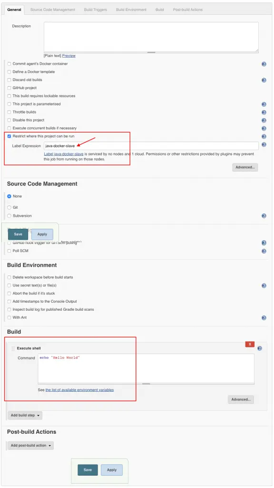
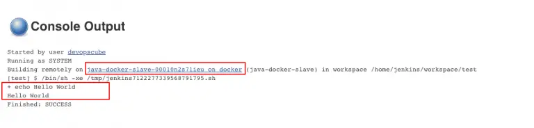
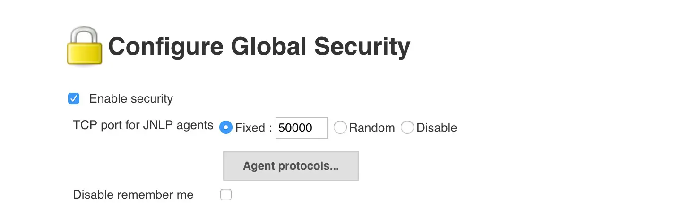
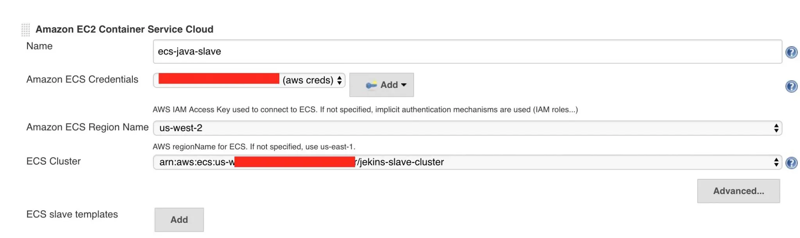
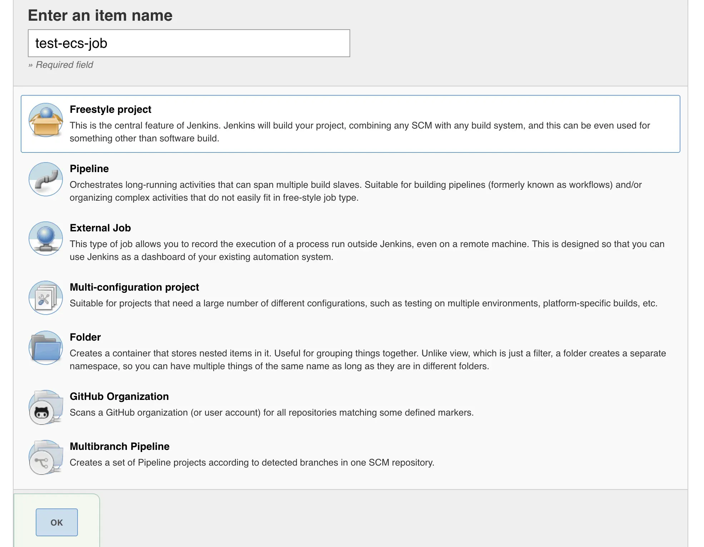
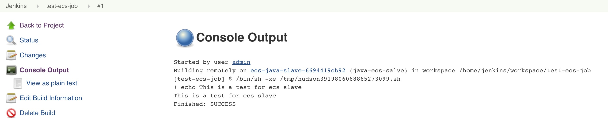
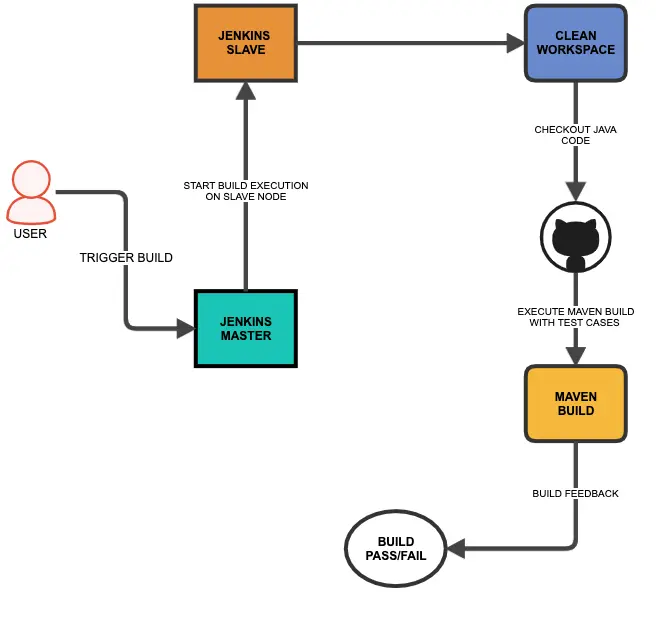
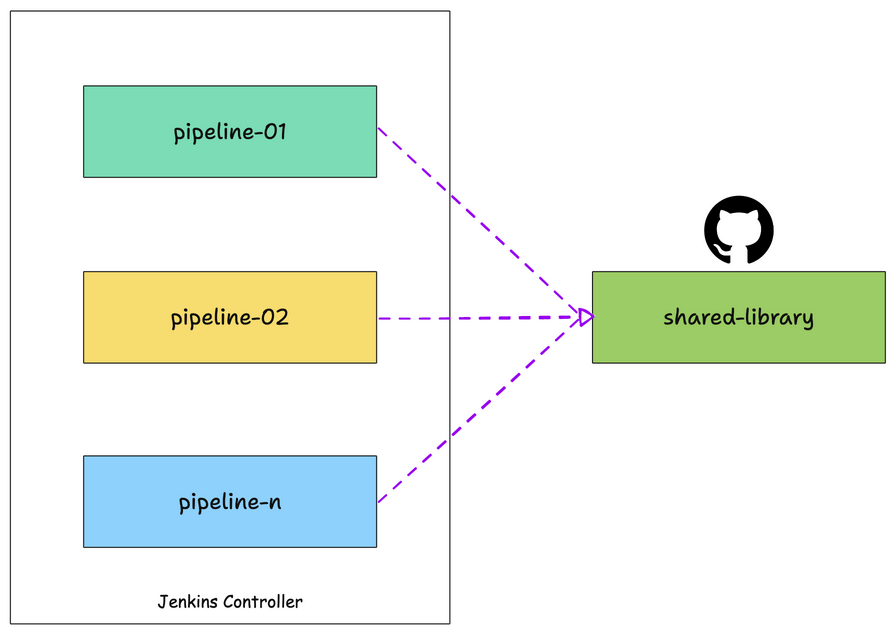

# Day 37 of 100DaysofCode

Feeling excited to start Day 37 of 100 DaysOfCode, today, I read an amazing blog on [Jenkins Explained – Beginners Guide](https://devopscube.com/jenkins-architecture-explained/) by <b>DevOpsCube</b>. This Blog contains beginner guide to Jenkins, Setup Docker Containers as Build Agents for Jenkins,Setup Jenkins Build Agents on Kubernetes Pods and many more.

## How the project works?

Clone this repository or simply refer to the README for a quick reference on how my repository works. Feel free to customize the commands based on your needs.

```bash
git clone https://github.com/Pravesh-Sudha/100-Days-Of-Code.git
cd day-37
```

## Setup Docker Containers as Build Agents for Jenkins

The resource utilization of the Jenkins agents is very less if you do not have builds happening continuously. It is better to use ephemeral Docker containers as Jenkins agents for better resource utilization in this scenario.

As you know, spinning up a new container takes less than a minute; every build spins up a new container, builds the project, and is destroyed. This way, you can reduce the number of static Jenkins build VMs.

### Configure a Docker Host With Remote API

The first thing we should do is set up a docker host. Jenkins server will connect to this host for spinning up the build agent containers. I am going to use the Centos server as my docker host. You can use any OS which supports Docker.

- Step 1: Spin up a VM, and install docker on it. You can follow the official documentation for installing docker. based on the Linux distribution you use. Make sure the docker service is up and running

- Step 2: Log in to the server and open the docker service file `/lib/systemd/system/docker.service`. Search for `ExecStart` and replace that line with the following: 

    ```
    ExecStart=/usr/bin/dockerd -H tcp://0.0.0.0:4243 -H 
    unix:///var/run/docker.sock
    ```

- Step 3: Reload and restart docker service.

    ```
    sudo systemctl daemon-reload
    sudo service docker restart
    ```

- Step 4: Validate API by executing the following curl commands. Replace `54.221.134.7` with your host IP.

    ```
    curl http://localhost:4243/version
    curl http://54.221.134.7:4243/version
    ```

### Create a Jenkins Agent Docker Image

If you are creating the image on your own, its image should contain the following minimum configurations to act as a slave:

- sshd service running on port 22.
- Jenkins user with password.
- All the required application dependencies for the build. For example, for a java maven project, you need to have git, java, and maven installed on the image.

Make sure the sshd service is running and can be logged into the containers using a username and password. Otherwise, Jenkins will not be able to start the build process.

**Note**: The default ssh **username** is jenkins and the **password** is also jenkins as per the given Dockerfile. You will have to use these credentials in the below configuration.

### Configure Jenkins Server With Docker Plugin

- Step 1: Head over to Jenkins Dashboard –> Manage Jenkins –> Manage Plugins.

- Step 2: Under the Available tab, search for “Docker” and install the docker cloud plugin and restart Jenkins. Here is the official plugin site. Make sure you install the right plugin as shown below.

- Step 3: Once installed, head over to Jenkins Dashboard –> Manage Jenkins –>Configure system.

- Step 4: Under “Configure System“, if you scroll down, there will be a section named “cloud” at the last. There you can fill out the docker host parameters for spinning up the slaves.

    **Note**: In Jenkins versions 2.200 or later you will find dedicated cloud configuration under Manage Jenkins –> Manage Nodes and Clouds

- Step 5: Under docker, you need to fill out the details as shown in the image below.

    **Note**: Replace “Docker URI” with your docker host IP. For example, `tcp://10.128.0.3:4243` You can use the “Test connection” to test if Jenkins is able to connect to the Docker host.

- Step 6: Now, from “Docker Agent Template” dropdown, click the “Add Docker template” and fill in the details based on the explanation and the image given below and save the configuration.

    Labels – Identification for the docker host. It will be used in the Job configuration. Here we use java-docker-slave
    Name: Name of the docker template. Here we use the same name as label ie, java-docker-slave
    Docker Image – bibinwilson/jenkins-slave:latest or the image that you created for the slave.
    Remote Filing System Root – Home folder for the user you have created. In our case, it’s /home/jenkins
    Credentials – click add and enter the SSH username and password that you have created for the docker image. Leave the rest of the configuration as shown in the image below and click save. If you are using my Docker image, the user will be jenkins & password is also jenkins.

    **Note**: There are additional configurations like registry authentication and container settings that you might have to use when configuring this set up in the corporate network.

    You can also use JNLP-based slave agents. For this, the configurations need a little change as shown below. Primarily the `docker image name` and the connect method.

    **Note**: For JNLP to work, you need to enable the JNLP connection port (50000) in Jenkins’s global security configuration (TCP port for inbound agents). Also, the Jenkins master firewall should be able to accept this connection form the docker host.

    By default, the workspace will not be persisted in the host. However, if you want the workspace to be persistent, add a host volume path under container settings.

    For example, if you want the workspace to be available at /home/ubuntu, you can add the volume path as shown below. /home/jenkins is the path inside the container.

    `/home/ubuntu:/home/jenkins`

    Towards the right of the Volumes option, if you click the question mark, it will show you additional volume options as shown below.

### Test Jenkins Build Inside a Docker container

Now that you have the slave configurations ready, we will test the docker agent plugin using a freestyle job.

- Create a freestyle job, select “Restrict where this project can be run” option and select the docker host as a slave using the label.

- Add a shell build step which echoes a simple “Hello World“



- If you have done all the configurations right, Jenkins will spin up a container, builds the project, and destroys the container once the build is done. First, you will see a pending notification as Jenkins tries to deploy a container on run time and establishes an SSH connection. After a few seconds, your job will start building.

- You can check the build logs in your jobs console output as shown below.



## Setup AWS ECS Cluster as Build Slave for Jenkins

Integrating docker into your build pipeline has lots of advantages. Especially when it comes to ECS cluster based build slave setup, the advantages are even more. Few of them are: 

1. In teams where continuous development happens, most the time the slave machines will be idle. By using ECS you can save cost by reducing the jenkins slave machines. The cluster capacity increases when there is a need for more resources.

2. Manage build environments in containers with tagged versions as compared to installing several versions of an application on the same machine.

3. Optimal usage of system resources by spinning up containers only when needed.

### Configuring ECS Cluster As Build Slave

I will guide you to setup jenkins slaves on an ECS cluster. In this setup, we have the following:

1. A working jenkins master(2.42-latest) running on a container, set up under an ELB.

Note: You can follow this article for setting up the latest Jenkins server using a container.

2. An ECS cluster with 2 Container instances. You can decide on the container instance capacity based on your project needs.

Note: It is better to have an ASG configured for the instances to scale the ECS cluster on deman

**Prerequisites**

1. In ec2 and ELB security groups, you should open the jnlp (50000) port for container slaves to connect to jenkins master.

2. Go to Manage Jenkns –> Configure Global Security, check,Enable Security Option check fixed and enter 50000 as shown in the image below.



**Install Amazon EC2 Container Service Cloud Plugin**

1. Go to Manage Jenkins –> Manage Plugins and search for Amazon EC2 Container Service Plugin

2. Install the plugin and restart it.

**Configure ECS settings on Jenkins**

To integrate ECS with the jekins master, jenkins should have AWS SDK access. You can enable this in two ways.

1. You can add an IAM role with EC2 Container service Full Access to the instance where you have installed the jenkins server.

2. You can add AWS access key and secret key to the Jenkins credentials and use it with the ECS configuration. If you are running jenkins in a container outside ECS, this will be the only available option. If you are running your jenkins server in ECS, then you can assign it a task role having privileges to ECS cluster.

In this tutorial, I am using the access key and secret key stored in Jenkins AWS credentials.

Follow the steps given below for configuring the ECS plugin to integrate the ECS cluster.

1. Go to Manage Jenkins –> Configure System and search for cloud option.

2. Click Add a new cloud dropdown and select Amazon EC2 Container Service Cloud

3. You need to fill up the following details.

Name: User defined name.

Amazon ECS Credentials: If you are using AWS access keys, select the relevant credential. If you using AWS role, leave it empty. The cluster will get listed automatically.

Amazon ECS Region Name: AWS region where you have the cluster.

ECS Cluster: Select your ECS cluster from the drop-down.

An example is shown below.



4. Next, you need to add a slave template with a docker image which acts as a slave node.

To do this, under ECS slave templates in the cloud configuration, click add and enter the details. In the following example, I have added a java JNLP slave image with label java-ecs-salve. Label is very important, because, we will use the label name in the job to restrict the job to run on containers.

**Test The Configuration**

To test the configuration, we will create a Freestyle project and try to run it on ECS.

1. Go to New item and create a freestyle project.

    

2. Under Restrict where this project can be run type the label name you have given in the slave template as shown in the image below.

3. Under Build select the execute shell option and type an echo statement as shown below.

    `echo "This is a test for ecs slave"`

4. Save and job and click build now

The build will go the pending start once it deploys the container. Once it executes the shell the container will be destroyed from ECS.

If you click the console output, you should get the following output.



## Setup Jenkins Build Agents on Kubernetes Pods

If you have a Kubernetes cluster in your environment, running Jenkins agents on the Kubernetes pods will give you good build isolation for different application versions.

Also, an ephemeral Kubernetes pod-based Jenkins agent is a great way of reducing the cost of the CI environment as Jenkins agents get spun up only if there is a build request.

**How Do Jenkins Kubernetes Pod Agents Work?**

1. Whenever you trigger a Jenkins job, the Jenkins Kubernetes plugin will make an API call to create a Kubernetes agent pod.
2. Then, the Jenkins agent pod gets deployed in the kubernetes with a few environment variables containing the Jenkins server details and secrets.
3. When the agent pod comes up, it uses the details in its environment variables and talks back to Jenkins using the JNLP method. The following images show the environment variables of the agent pod.
4. All the build steps from the Jenkinsfile run on that pod. Once the build is complete, the pod will get terminated automatically. There are also options to retain the build pod.
5. The Jenkins Kubernetes plugin takes care of all the communication from Jenkins to the Kubernetes cluster.
6. Also, as long as your Kubernetes cluster scales, you can scale your Jenkins build agents without any issues.

**Setting Up Jenkins Build Pods On Kubernetes**

Here is what we are going to do:

- Create a namespace devops-tools
- Create a Kubernetes service account named jenkins-admin with permissions to manage pods in devops-tools namespace. This service account will be used by Jenkins to deploy the agent pods. (Both internal & external Jenkins)
- Deploy Jenkins in devops-tools namespace with the jenkins-admin service account. (If you don’t have an existing Jenkins)
- Configure Kubernetes Jenkins Plugin for Jenkins to interact with Kubernetes cluster and deploy build agents.

1. Create a namespace called `devops-tools`

    `kubectl create namespace devops-tools`

2. Create a service-account.yaml file which contains the role and role-binding for the service account with all the permission to manage pods in the devops-tools namespace.

3. Apply the yaml file:

    `kubectl apply -f service-account.yaml`

4. Create a `deployment.yaml` file as stated in the directory and apply it:

    `kubectl apply -f deployment.yaml`

5. After a couple of minutes, the Jenkins deployment will be up and you will be able to access any Kubernetes node on port `32000`.

## Types of Jenkins Pipeline

There are two types of Jenkins pipeline code.

- Declarative Pipeline
- Scripted Pipeline

In this tutorial, we will focus only on the declarative syntax as it is an advanced version of the scripted pipeline with extensible features. Also, I recommend using the declarative pipeline approach for all your Jenkins use cases. There are a lot of features and benefits you will get from the declarative pipeline approach.

For better understanding, we will create a pipeline for the Java Spring Boot application build using the declarative pipeline as code.

**Prerequisites**

- Jenkins master (Check Jenkins installation steps)
- Jenkins slave node connected to the master (Check Jenkins slave setup guide)
- Access to Github.com from your Jenkins server. If you are trying out from your corporate Jenkins setup, you can use your organization’s private git repo.

Here is the pictorial representation of the simple build pipeline we are going to build;



**Script.groovy Explanation**

Now lets understand what each block means.

- The Pipeline Block: All your pipeline as code should be wrapped inside the pipeline block.
    ```
    pipeline {

    ---<All Pipeline blocks go here>---

    }
    ```

- Agent Block: In the agent block you have to mention the slave details where you want to run the pipeline job. It supports both static slaves and docker based dynamic slaves. Here we have mentioned label as “SLAVE01“. It is the name of a slave node.
    ```agent {
            node {
                label 'SLAVE01'
            }
        }

    ```
    
- Tools Block: Here you can refer to the tools you have configured in the Jenkins Global tool configuration. We have covered the tool configuration in the next section.
    ```
    tools { 
            maven 'maven3' 
        }
    ```

- Options Block: It contains all the options required for the job. One example, we have given is “Build Discarder” to rotate the build logs.
    ```
    options {
            buildDiscarder logRotator( 
                        daysToKeepStr: '15', 
                        numToKeepStr: '10'
                )
        }
    ```

- Environment Block: In this block, you can mention all the required variables for the job which has to be available in all the stages. You can define any number of variables like a key-value pair.
    ```
    environment {
        APP_NAME = "DCUBE_APP",
        APP_ENV  = "DEV"
    }
    ```
    
- Stages: Stages block contains multiple stages.

    ```
    stages {

    ---<All Pipeline Stages Go Here>---

    }
    ```
    
- Stage Block: A stage is a subset of stages. Each stage has a steps block.

- Steps Block: In each steps block you define a set of operations to perform. In the following example, we have shown a workplace cleanup step and echoing a variable we defined in the environment block. What you want to run inside each stage depends totally on your use case.
    ```
    stage('Cleanup Workspace') {
                steps {
                    cleanWs()
                    sh """
                    echo "Cleaned Up Workspace for ${APP_NAME}"
                    """
                }
            }
    ```

## What is Jenkins Shared Library

When we say CI/CD as code, it should have modularity and reusability. And mainly it should follow the DRY principles. This is where Jenkins Shared Library comes into play.

Shared library – A library that can be shared.

Jenkins Shared library is the concept of having a common pipeline code in the version control system that can be used by any number of pipelines just by referencing it. In fact, multiple teams can use the same library for their pipelines.



You can compare it with the common programming library. In programming, we create individual libraries that can be used by anyone just by importing them into their code.A shared library is a collection of Groovy files (DSLs + Groovy).

Assume, you have ten Java microservices pipelines, the maven build step gets duplicated on all the ten pipelines. And whenever a new service gets added, you will have to copy and paste the pipeline code again. Now, let’s say you want to change some parameters in the Maven build step. You will have to change it in all the pipelines manually.

To avoid pipeline code duplication, we can write a shared library for Maven build, and in all the pipelines we just have to refer to the Maven build library code. In the future for any Maven build changes, all you have to update the shared library code. It will be applied to all the pipelines using the Maven build library.
