# Day 38 of 100DaysofCode

Feeling excited to start Day 38 of 100 DaysOfCode, today, I read an amazing blog on [Jenkins Explained – Beginners Guide](https://devopscube.com/jenkins-architecture-explained/) by <b>DevOpsCube</b>. This Blog contains beginner guide to Jenkins, Java Continuos Integration with Jenkins – Beginners Guide, Jenkins Automated Build Trigger On Github Pull Reques and many more.

## How the project works?

Clone this repository or simply refer to the README for a quick reference on how my repository works. Feel free to customize the commands based on your needs.

```bash
git clone https://github.com/Pravesh-Sudha/100-Days-Of-Code.git
cd day-38
```

## Java Continuos Integration with Jenkins

To set up Continuos Integration work flow for a Java application, you need the following.

1. A version control system – we will use Git and Github.

2. A Continous Integration tool – We will use Jenkins

3. A build tool – We will use maven.

For the demo, I will be using a minimal spring pet clinic web app from Github. It has a minimal in-memory DB, so you don’t have to do a complex setup. You can just build and deploy the app.

**Setting Up a Github Repository**

First, you need to set up a Github Repository for your project. So that you can push your local code to remote Github repository. 

**Setting Up Jenkins**

I am setting up a Jenkins server using the official Jenkins docker image. If you don’t have any idea about docker, I highly recommend you to try it out.

It is not mandatory to setup Jenkins using docker, you can also manually configure it on a server.

To run a docker Jenkins container, you just have to execute the following command on a docker host. Just replace `/home/ec2-user/jenkins_home` with a folder from your host machine. By doing this, all the Jenkins jobs and configuration will persist in you host even if you delete the container.

`sudo docker run -p 8080:8080 -p 50000:50000 -v /home/ec2-user/jenkins_home:/var/jenkins_home jenkins &`

You can access the Jenkins UI on port :8080 from the browser.

Now, we have a Jenkins server up and running.

**Configuring Maven**

Since we are using maven as a build tool, we need to configure maven on Jenkins. To do this, go to manage jenkins–>configure system.

Under configure system, you will see an option for maven. click add maven option, give it a name(arbitrary) and save it.

**Integrating Github Petclinic Repo with Jenkins**

Now we have all the required plugins and tools for the GitHub Integration. Next step is to create a job where you will have the option to integrate the Petclinic repo with Jenkins.

Follow the steps given below:

1. From the Jenkins home page, click “create a job” option.
2. Give your job a name, eg: petclinic-job and select maven project option.
3. click ok.
4. In the next page, Under “source code management” option, select git and enter your GitHub repository URL. eg: `https://github.com/bibinwilson/java-app` as shown below.

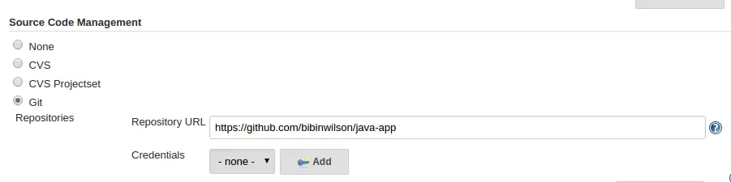

5. Under Build option –> Goals and options, enter “clean install” and save it.

**Triggering the build**

Now. We have all the integrations in place. We just have to trigger the build.

To do this, click build now option at the left.

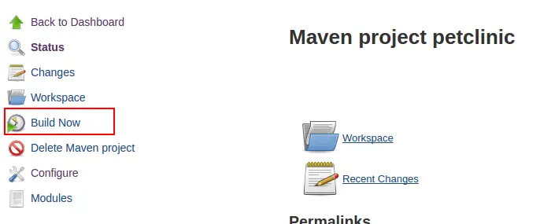

You can see the status of the build process on the left.

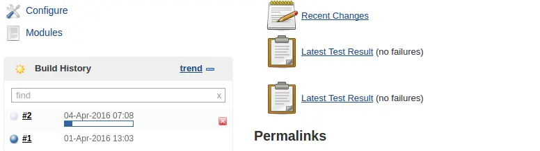

If you click on the job, you can see the process happening at the backend. If the build succeeds, you can find the build war file in the workspace –> target folder.

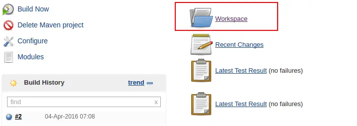

## Jenkins Automated Build Trigger On Github Pull Request

Building projects based on pull request is something you cannot avoid in CI/CD pipelines. Nowadays every team does several deployments/operations per day and lots of builds have to happen in this process.

**Trigger Builds Automatically On Github Pull Request**

- Install Github Pull Request Builder Plugin from `manage jenkins --> manage plugins`

- After installing, Head over to Manange Jenkins --> Configure System. Find “GitHub Pull Request Builder” section and click add credentials.

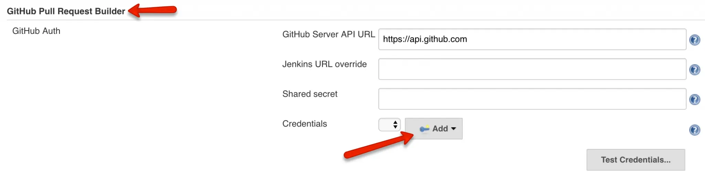

- Enter your Github username and password and add it.

- You can test the Github API connection using the test credentials button. It should show “connected” as shown below. Save the configuration after testing the API connection.

**Github Repo Webhook Configuration**

For Jenkins to receive PR events through the pull request plugin, you need to add the Jenkins pull request builder payload URL in the Github repository settings.

Go to Github repository settings, and under webhooks, add the Jenkins pull request builder payload URL. It has the following format:

`http://<Jenkins-IP>:<port>/ghprbhook/`

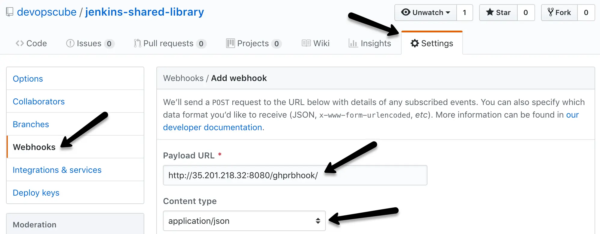

If you need just the PR triggers, you can select the “Let me select individual events” option and select just the “Pull requests” option. Save the webhook after selecting the required events. add webhook in github for jenkins

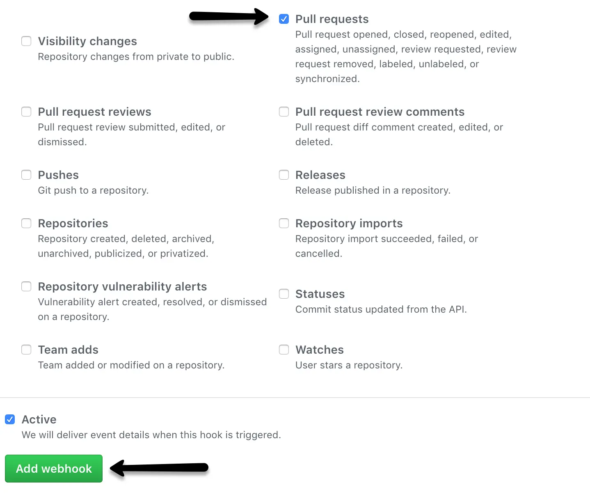

Once saved, go back to the webhook option and see if there is a green tick. It means Github is able to successfully deliver the events to the Jenkins webhook URL. github activated webhook.

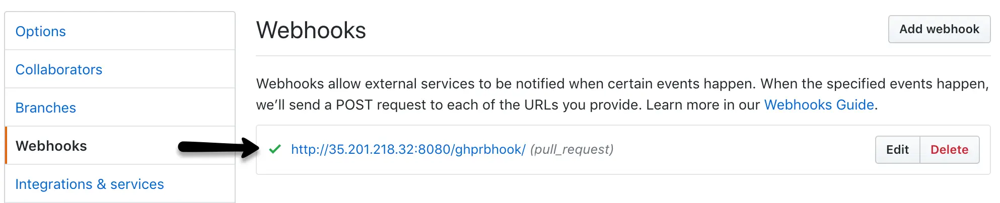

## How To Build Docker Image In Kubernetes Pod

When it comes to CI/CD, there could be VM & container-based applications. Ideally, one would use existing VM infrastructure to build Docker images. However, if you have a containerized infrastructure, it is better to utilize it for the CI/CD workflow.

**Building Docker in Docker**

In CI, one of the main stages is to build the Docker images. In containerized builds, you can use Docker in the Docker workflow. You can check out the Docker in Docker article to understand more.

But this approach has the following disadvantages:

- The Docker build containers run in privileged mode. It is a big security concern and it is kind of an open door to malicious attacks.
- Kubernetes removed Docker from its core. So, mounting docker.sock to the host will not work in the future, unless you add a docker to all the Kubernetes Nodes.

**Build Docker Image In Kubernetes Using Kaniko**

kaniko is an open-source container image-building tool created by Google. It does not require privileged access to the host for building container images.

**Create Dockerhub Kubernetes Secret**

We have to create a kubernetes secret of type docker-registry for the kaniko pod to authenticate the Docker hub registry and push the image.

Use the following command format to create the docker registry secret. Replace the parameters marked in bold.

```kubectl create secret docker-registry dockercred \
    --docker-server=https://index.docker.io/v1/ \
    --docker-username=<dockerhub-username> \
    --docker-password=<dockerhub-password>\
    --docker-email=<dockerhub-email>
```
**Pod.yaml Explanation**

–context: This is the location of the Dockerfile. In our case, the Dockerfile is located in the root of the repository. So I have given the git URL of the repository. If you are using a private git repository, then you can use GIT_USERNAME and GIT_PASSWORD (API token) variables to authenticate git repository.

–destination: Here, you need to replace <dockerhub-username> with your docker hub username with your dockerhub username for kaniko to push the image to the dockerhub registry. For example, in my case its, bibinwilson/kaniko-test-image:1.0

Now deploy the pod.

`kubectl apply -f pod.yaml`

To validate the docker image build and push, check the pod logs.

`kubectl logs kaniko --follow`

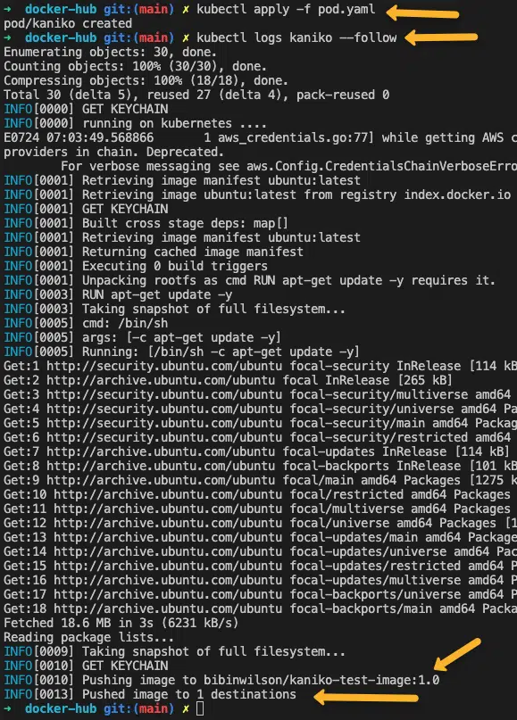

## What is a Multi-branch Pipeline?

A multi-branch pipeline is a concept of automatically creating Jenkins pipelines based on Git branches. It can automatically discover new branches in the source control (Github) and automatically create a pipeline for that branch. When the pipeline build starts, Jenkins uses the Jenkinsfile in that branch for build stages. 

You can choose to exclude selected branches if you don’t want them to be in the automated pipeline with Java regular expressions. Multi-branch pipeline supports PR based branch discovery. Meaning, branches get discovered automatically in the pipeline if someone raises a PR (pull request) from a branch. If you have this configuration enabled, builds will get triggered only if a PR is raised. So if you are looking for a PR based Jenkins build workflow, this is a great option.

You can add conditional logic to the Jenkinsfile to build jobs based on the branch requirement:

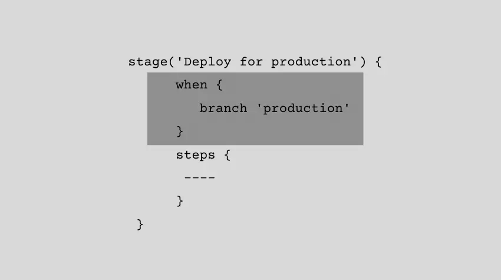

The following image shows how a multi-branch pipeline workflow Looks like:

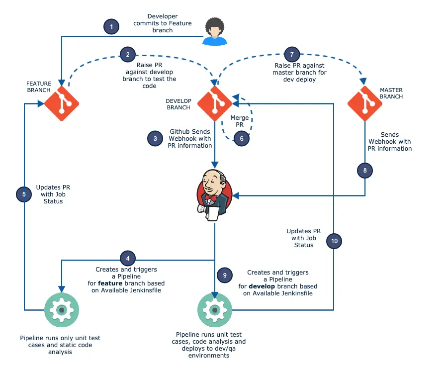

