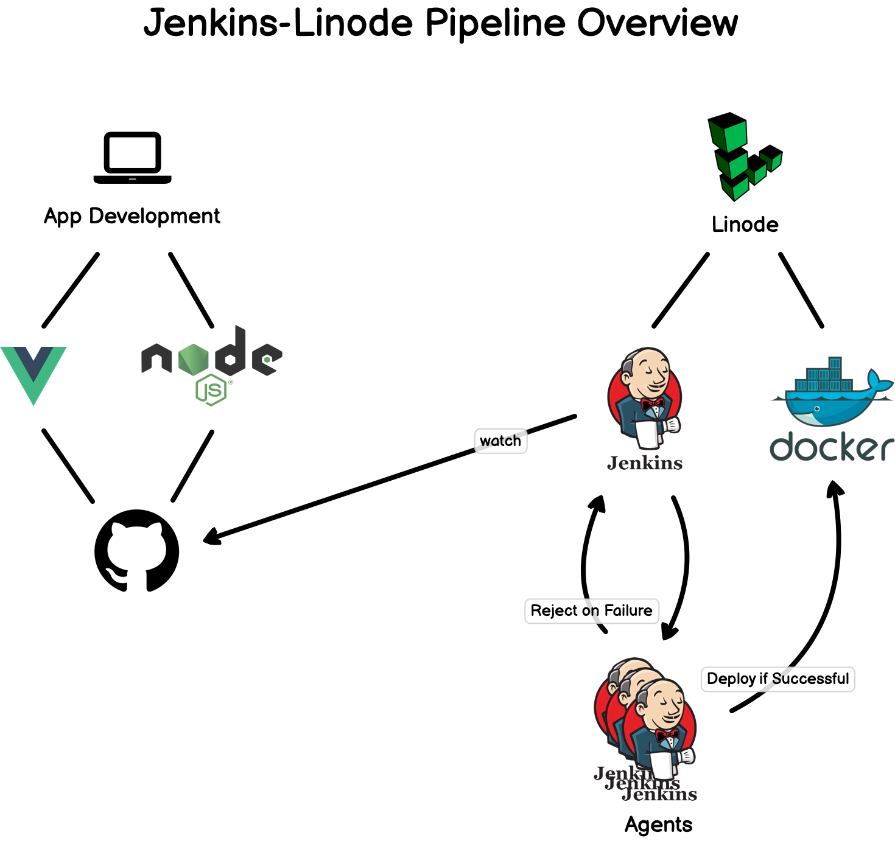

# Day 39 of 100DaysofCode

Feeling excited to start Day 39 of 100 DaysOfCode, today, I eatched an amazing video on [Jenkins Tutorial – How to Deploy a Test Server with Docker + Linux (Full Course)](https://youtu.be/f4idgaq2VqA?si=twhXDLz2RIs0KrBs) by <b>FreeCodeCamp</b>. This Video contains beginner guide to Jenkins,  and many more.

## How the project works?

Clone this repository or simply refer to the README for a quick reference on how my repository works. Feel free to customize the commands based on your needs.

```bash
git clone https://github.com/Pravesh-Sudha/100-Days-Of-Code.git
cd day-39
```

## What is Jenkins?

According to the docs, Jenkins is a self-contained, open source automation server which can be used to automate all sorts of tasks related to building, testing, and delivering or deploying software.

Jenkins can be installed through native system packages, Docker, or even run standalone by any machine with a Java Runtime Environment (JRE) installed. Continuous delivery is an approach where teams release quality products frequently and predictably from source code repository to production in an automated fashion.

## Project Architecture



## Setting Up Linode

- Signing up for Linode ($100 credit)

- Jenkins in the Linode marketplace

- Configuring Jenkins - admin account, plugins, settings

- Deploying an app to Github and using the Jenkins Github plugin

- Using Jenkins to test and deploy to Dockerhub

- Another Linode server will be watching for updates on Dockerhub and pull & run the updated container

- Reviewing Jenkins features like build history

### Setting Up Jenkins

**Make sure you follow these steps to set up Jenkins from the Linode marketplace**: https://www.linode.com/marketplace/apps/linode/jenkins/

- [Jenkins Handbook and Guides](https://www.jenkins.io/doc/book/)

### Jenkins Plugins

- [Jenkins Plugin Index](https://plugins.jenkins.io/) - Search for plugins

### Blue Ocean UI

- [Blue Ocean Docs & Getting Started Guide](https://www.jenkins.io/doc/book/blueocean/)

### Jenkins Pipelines

Shell scripts for the Pipeline:

```shell
ls -la

cd curriculum-front && npm i && npm run test:unit

docker build -f curriculum-front/Dockerfile . -t fuze365/curriculum-front

docker login -u $DOCKERHUB_USER -p $DOCKERHUB_PASSWORD

docker push fuze365/curriculum-front:latest
```

- [Getting started with Pipelines](https://www.jenkins.io/doc/book/pipeline/getting-started/)
- [In-Depth Pipeline Syntax](https://www.jenkins.io/doc/book/pipeline/syntax/)
- [Freestyle versus Pipeline Projects (old UI)](https://www.youtube.com/watch?v=IOUm1lw7F58)

### SSH'ing into Linode Servers (installing Git)

Commands for installing Git and Node on server:

```shell
# install Git
apt install git
git --version

# node version 16 (comes with npm)
curl -sL https://deb.nodesource.com/setup_16.x | sudo -E bash -
apt-get install -y nodejs
node --version
npm --version
```

- [Using the Lish Console](https://www.linode.com/docs/guides/using-the-lish-console/)
- [Official video on how to SSH into Linode server](https://www.youtube.com/watch?v=ZVMckBHd7WA)
- [SSH into Linode server articles](https://www.linode.com/docs/guides/networking/ssh/)

- [How to install Git on Linux](https://www.linode.com/docs/guides/how-to-install-git-on-linux-mac-and-windows/)
- [How to install Node with npm on Linux](https://www.linode.com/docs/guides/install-and-use-npm-on-linux/)

### Jenkinsfile

- [Using a Jenkinsfile](https://www.jenkins.io/doc/book/pipeline/jenkinsfile/)
- [Deep Dive into a Jenkinsfile video](https://www.youtube.com/watch?v=7KCS70sCoK0&list=PLy7NrYWoggjw_LIiDK1LXdNN82uYuuuiC&index=6)

### Docker & Dockerhub

- [Sign up for an account on Dockerhub](https://hub.docker.com/)